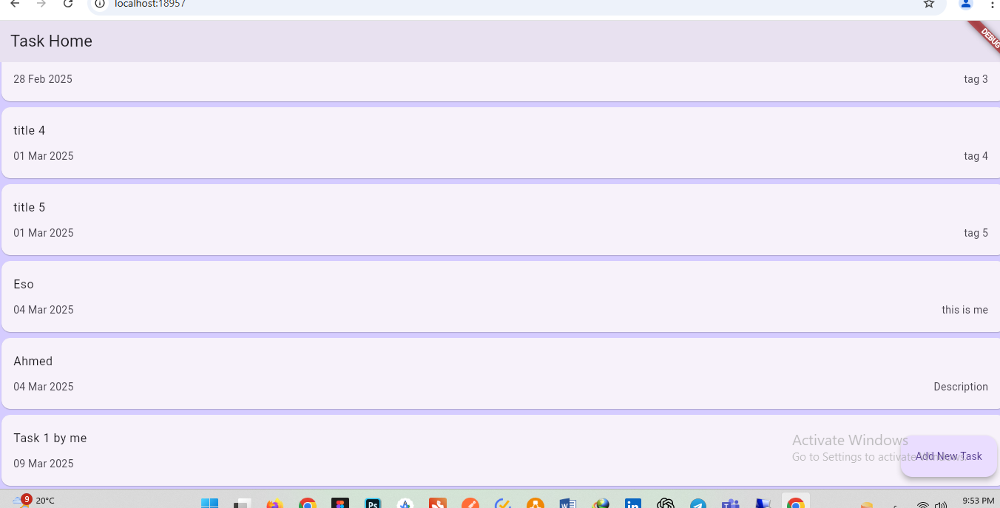
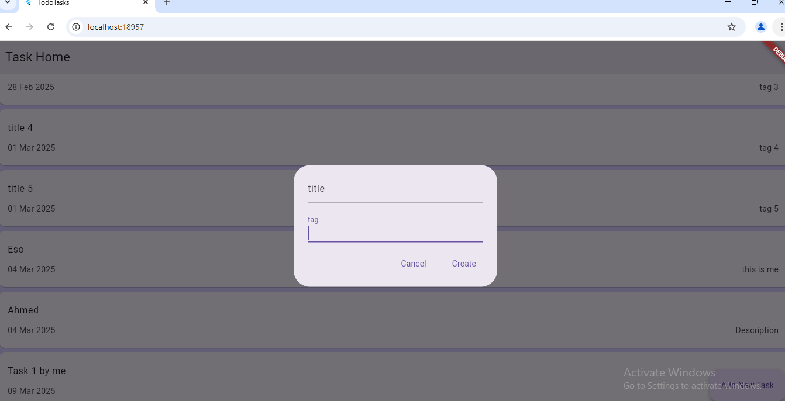

# 📱 Flutter Clean Architecture App

🚀 A Flutter application following Clean Architecture principles, built with Bloc, Dio, GetIt, and SQLite.

---

## 📸 Screenshots




---

## 🛠️ Technologies Used
- **Flutter & Dart** 🚀
- **Clean Architecture** 🏛
- **State Management:** Bloc
- **Networking:** http
- **Dependency Injection:** GetIt
- **UI:** Material Design with Custom Widgets

---

## 📥 Installation
1. Clone the repository:
   ```sh
   git clone https://github.com/eslamabid175/Flutter-Clean-Architecture-Todo.git
   cd Flutter-Clean-Architecture-Todo
